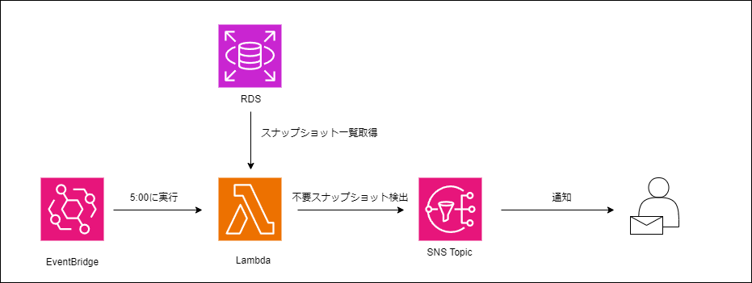
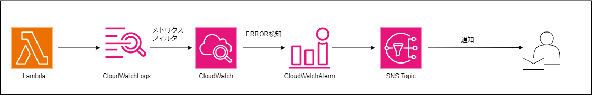

## 概要
保存されるRDS手動スナップショットを確認し、同一クラスターにおいて重複して作成されているかつ指定の日数以前に作成されたものを検出します。
検出方法は毎朝5時をトリガーにEventBrdgeからLambdaが実行され、該当スナップショットを検出した場合指定のEmailアドレスに結果が通知されます。
Lambda関数でエラーが発生した場合、CloudWatchLogsのメトリクスフィルターでエラーが検出され指定のEmailアドレスに通知されます。

## 構成
#### 不要スナップショット検出

#### Lambdaエラー通知

## CloudFormationで作成されるリソース
  - Lambda
  - SNSトピック
  - SNSサブスクリプション
  - Lambda実行ロール
  - CloudWatchLogs
  - CloudWatchLogs メトリクスフィルター
  - CloudWatchアラーム
  - EventBridgeルール
  - Lambda Permission

## 使用の流れ
1. Lambdaコード記載のzipファイルをアップロードするS3バケットを作成する。
2. Lambdaコード記載のzipファイルをアップロードする
3. CloudFormationテンプレートを実行する。
4. 指定のEmailアドレスで受信したSNSトピックを承認する。
5. 作成されたLambdaをTest実行し、意図した挙動を確認する。

## 詳細
#### Lambda
- 不要スナップショットを検出するLambda関数を実行します。
- 重複するRDSクラスターのスナップショットの一覧を取得し、パラメータに指定した日数より前に作成されたものを指定のメールアドレスに通知します。

#### Lambda実行ロール
- Lambda関数に設定されるRoleです。
- RDSクラスタースナップショット取得、SNSパブリッシュ、CloudWatchLogsへのログ出力を許可するポリシーが設定されます。

#### SNSトピック/サブスクリプション
- Lambdaコード内でパブリッシュされます。
- パラメータで指定のメールアドレスがサブスクリプションに登録されます。

#### CloudWatchLogs/メトリクスフィルター/CloudWatchアラーム
- Lambdaのログが出力されます
- ログの保存期間は1日です。
- Lambdaの処理が失敗した場合それをメトリクスフィルターで検出しエラーメトリクスに送信します。
- エラーメトリクスに基づいたCloudWatchアラームにより、エラー発生をSNSトピック サブスクリプションに登録されたメールアドレスに送信されます。

#### EventBridgeルール/Lambda Permission
- Lambda処理が毎日AM 5:00に実行されるようEventBridgeルールを設定します。
- LambdaがEventBridgeからの実行を許可するようにパーミッションを作成します。

## リソースにかかる料金
#### Lambda
- 月間 100万回のリクエスト無料

#### EventBridge
- 月間 14,000,000 回の呼び出しを無料

#### SNS Topic
- 月間 1,000件のメール配信無料

#### CloudWatchLogs
- 5GBのデータ取り込み、アーカイブ無料
- 収集 (データの取り込み)	0.76USD/GB

#### CloudWatchカスタムメトリクス
- 10カスタムメトリクス無料
- 0.3ドル/個

#### CloudWatchアラーム
- 10アラーム無料
- 0.1ドル/個
